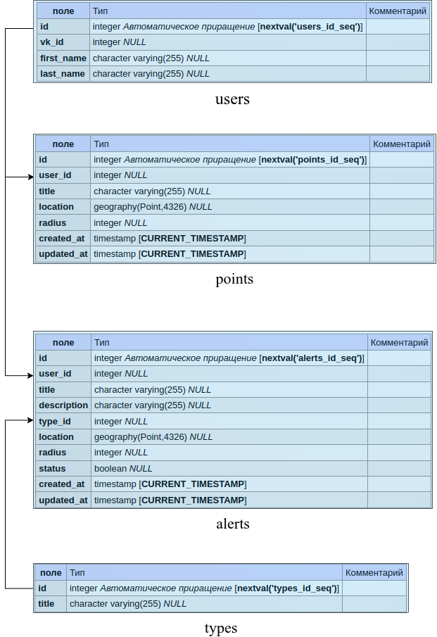

# osiris
---

[](http://forthebadge.com)


# БД POSTGRES(POSTGIS)


# Микросервисы
## Auth Service 
+ OAuth2
+ Генерирует токен для доступа к микросервисам


## Alert Service 
+ создает тревоги 
+ получает тревоги
+ удаляет тревоги
Записывает в БД и передает по брокеру сообщений(alerts) следующему сервису


## Points Service 
+ CRUD точек
+ Location SRID 4326

### */create/point POST* 
Создание точки. 
- user_id из users.
- title строка
- location используется SRID 4326 
- radius число
```json
{
	"user_id":1,
	"title":"test",
	"location":"POINT(0 33)",
	"radius":100
}
```


### */get/point/{id} GET*
Получение точки.


### */get/points/{user_id} GET*
Получение всех точек определенного юзера.


### */update/point/title PUT*
Обновление названия точки.
```json
{
	"id":1,
	"title":"test"
}
```


### */update/point/location PUT*
Обновление локации точки.
```json
{
	"id":1,
	"location":"POINT(0 30)"
}
```


### */update/point/radius PUT*
Обновление радиуса точки.
```json
{
	"id":1,
	"radius":1000
}
```

### */delete/point*
Удаление точки.
```json
{
	"id":1
}
```

## Processing Service 
+ Обработка запросов
Получается нужные точки и тревогу из (alerts) 
Генерирует запросы и отсылает в брокер сообщений(notification) 


## Notification Service 
+ Отправка уведомлений
Получает запросы из брокера(notification) и отправляет сообщения