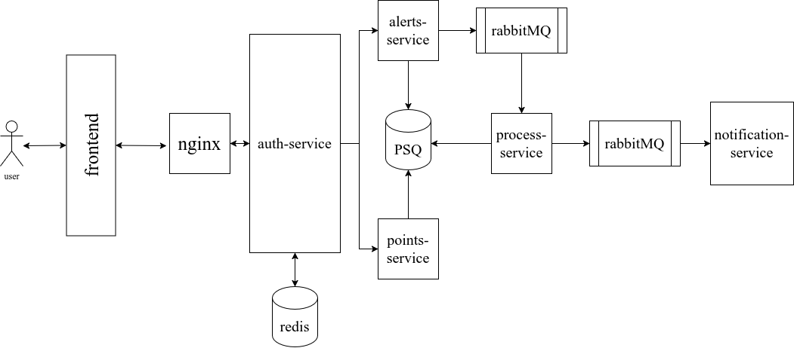

# osiris
---

[](http://forthebadge.com)


Серверная часть приложения Osiris. 
## Стэк:
1. Go(gin)
2. PostgeSQL (PostGis)
3. Redis
4. RabbitMQ
5. NGINX

## Схема


## Запуск

1. Скачать репозиторий
```
git clone https://github.com/giicoo/osiris
```
2. Запустить сервисы необходимые
```
docker-compose up db adminer redis rabbitmq
```

3. Запустить основные микросервисы
```
docker-compose up points-service alerts-service auth-service process-service notification-service
```

4. Если нужно не локально, а на сервере, можно запутить nginx, но настроить домен в `./nginx/nginx.conf`
```
docker-compose up nginx
```

5. Также нужно обновить сертификаты
```
docker-compose up certbot
```

